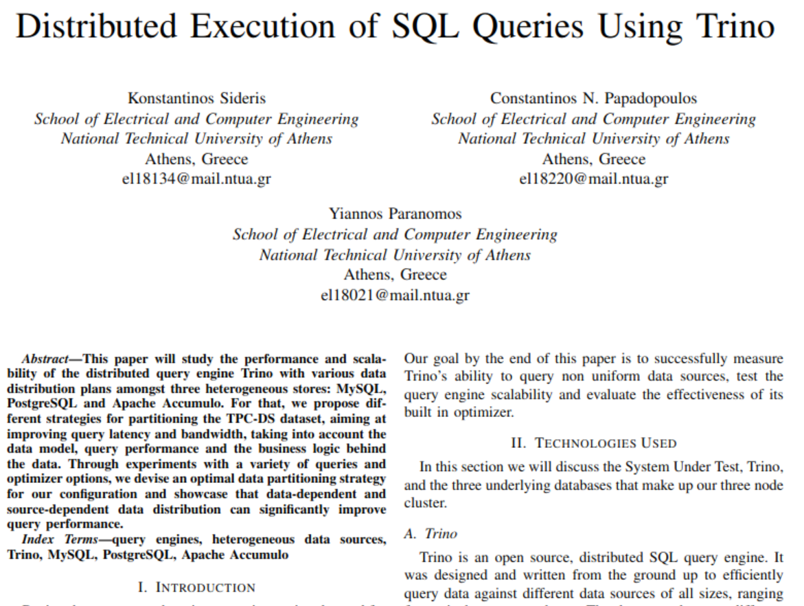

# Trino Benchmarks: MySQL, PostgreSQL, Accumulo

## **Overview**
This paper will study the **performance and scalability of the distributed query engine Trino** with various **data distribution plans** amongst **three heterogenous stores: MySQL, PostgreSQL and Apache Accumulo**. For that, we propose **3 different strategies for partitioning the TPC-DS dataset**, aiming at improving query latency and bandwidth, and taking into account both the data model and the business model. Through experiments with a variety of queries and optimizer options, we devise the optimal data partitioning strategy for our configuration and showcase that data-dependent and source-dependent data distribution can significantly improve performance and aid Trino’s optimizer.  
[Read More](./)

## **Tools used:**

## System description
| Node | cores | system RAM | disk size | Role               | Additional processes | RAM devoted to Trino |
|------|-------|------------|-----------|--------------------|----------------------|----------------------|
| 1    | 4     | 8 GB      | 30 GB     | coordinator+worker | Accumulo             | 4 GB                 |
| 2    | 4     | 8 GB      | 30 GB     | worker             | MySQL                | 4 GB                 |
| 3    | 4     | 8 GB      | 30 GB     | worker             | Postgres             | 4 GB                 |

 In this work, all the experiments are carried in a cluster of 3 virtual machines as described above. Due to shortage of VMs, we are forced deploy the DBMSes in nodes which
will act also as Trino nodes, since running two DBMSes in the same node was prohibitive, because it would lead to bottlenecks in bandwidth during the data movement to the Trino workers and also in memory. Thus, this can potentially lead to underutilization since the memory of each node will
have to be shared between the database system and the Trino worker. On the other hand it has the desirable property of eliminating the need for data movement in the case where the data in the local database will be processed by the Trino node in the same VM. As it will become evident from the following experiments, this is something often exploited by the cost based optimizer and leads to overheads where it is not.

## **Contributors**

| Name | Academic ID | email |
| --- | --- | --- |
| Kostantinos Sideris | el18134 | el18134@mail.ntua.gr |
| Constantinos N. Papadopoulos | el18220 | el18220@mail.ntua.gr|
| Yiannos Paranomos | el18021 | el18021@mail.ntua.gr |
---
  

## Table of Contents: Navigation Guide
For clarity, not every guide is include in the main README. You can reference the following, for a comprehensive guide through the entire project. Any 'LEGACY' folder in the project, is not included in our tests, but provides some additional implementation that may find other use cases. 
### Deployment
Contains instructions for the Deployment of the Virtual Machines, Trino and Accumulo. Here you will also find bash files for starting and stopping Accumulo on your machine.
- [Accumulo Deployment](./Deployments/Accumulo-Deployment/README.md)
- [PostgreSQL Deployment](./Deployments/PostgreSQL-Deployment/README.md)
- [MySQL Deployment](./Deployments/MySQL-Deployment/README.md)
- [Trino Deployment](./Deployments/Trino-Deployment/README.md)
### Populate-Implementation 
Contains instructions and files for populating the Databases.
- [Accumulo Populate](./Populate-Implementations/Accumulo-Populate/README.md)
- [MySQL-PostgreSQL Populate](./Populate-Implementations/MySQL-Postgres-Populate/README.md)

## Trino Performance Measurements
For a detailed explanation of hte strategies used for this work, reference this work's paper:  
  
[View the full paper](paper.pdf)
